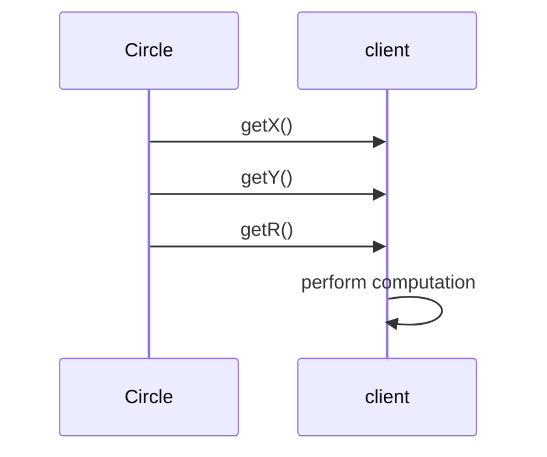
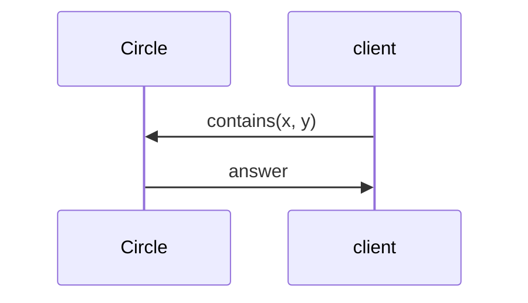

# Unit 6: Tell, Don't Ask

!!! abstract "Learning Objectives"

    After this unit, students should be able to:

    - explain the role of accessors and mutators, and why they are not always desirable in object-oriented design
    - identify how accessors and mutators can increase coupling and leak implementation details
    - apply the Tell, Don’t Ask principle to redesign client–class interactions
    - refactor client code that relies on getters into object-oriented method calls
    - reason about encapsulation trade-offs when deciding whether to expose object state

!!! abstract "Overview"

    In earlier units, we learned how to define classes with private fields and public methods, and how encapsulation helps protect an object’s internal state.

    In this unit, we examine a common but subtle design mistake: exposing an object’s internal state through accessors and mutators, and pushing logic into client code. Although getters and setters may seem harmless—or even “good practice”—they can quietly weaken encapsulation and increase coupling.

    We introduce the Tell, Don’t Ask principle, which encourages clients to tell objects what to do, rather than asking for their internal data and operating on it externally. This shift helps us design objects that are more robust, flexible, and easier to change.

## Accessors and Mutators

Similar to providing constructors, a class can also provide methods to retrieve or modify the properties of the object.  These methods are called the _accessor_ (or _getter_) or _mutator_ (or _setter_).
While accessors and mutators are common, using them indiscriminately can undermine encapsulation and lead to fragile designs.

The example below shows a `Circle` class with accessor and mutator methods for its fields.

```Java title="Circle v0.4" hl_lines="12-34"
class Circle {
  private double x;
  private double y;
  private double r;

  public Circle(double x, double y, double r) {
    this.x = x;
    this.y = y;
    this.r = r;
  }

  public double getX() {
    return this.x;
  }

  public void setX(double x) {
    this.x = x;
  }

  public double getY() {
    return this.y;
  }

  public void setY(double y) {
    this.y = y;
  }

  public double getR() {
    return this.r;
  }

  public void setR(double r) {
    this.r = r;
  }

  public double getArea() {
    return 3.141592653589793 * this.r * this.r;
  }
}
```

In the code above, we can categorise the accessor and mutator of each field as follows.

| Fields | Accessors | Mutators |
|--------|-----------|----------|
| `x` | `getX` | `setX` |
| `y` | `getY` | `setY` |
| `r` | `getR` | `setR` |

Do note that using the prefix `get` or `set` for accessor and mutator is _optional_, although it is a good practice.  For instance, we could name a mutator that sets the radius as `resize` instead of `setRadius`.

### Accessor/Mutator vs Public

Instead of providing an accessor method and a mutator method for every private field, why don't we just declare the fields as `public` and access them directly?  

Having both an accessor and a mutator for a private field is still _better_ than setting the field `public`.  By having an accessor and a mutator, we are adding a layer of abstraction.  For instance, we can still rename a field without affecting the client.

Another advantage is that we may be able to perform some checks on the mutator and prevent certain invalid values from ever being assigned to the field.  Consider the method `setR` in our `Circle` v0.4 above.  A slightly better approach is to implement it with a check to prevent setting the radius to a non-positive value.

```java
public void setR(double r) {
  if (r > 0) {
    this.r = r;
  } else {
    // Handle error here.  Code ommitted for simplicity.
  }
}
```

### How Accessor/Mutator Can Be Harmful

Since having accessors and mutators is better than having public fields, does it mean that we should always provide an accessor and a mutator for every private field?

Let's consider a slightly different version of `Circle` where the center coordinate and radius are integers, perhaps because the implementer does not have the foresight that they need to be floating-point numbers.

```Java title="Circle v0.4a with Integer Coordinates" hl_lines="2-34"
class Circle {
  private int x;
  private int y;
  private int r;

  public Circle(int x, int y, int r) {
    this.x = x;
    this.y = y;
    this.r = r;
  }

  public int getX() {
    return this.x;
  }

  public void setX(int x) {
    this.x = x;
  }

  public int getY() {
    return this.y;
  }

  public void setY(int y) {
    this.y = y;
  }

  public int getR() {
    return this.r;
  }

  public void setR(int r) {
    this.r = r;
  }

  public double getArea() {
    return 3.141592653589793 * this.r * this.r;
  }
}
```

Suppose a client of the class wishes to check if, given a point (x,y), does it lie within the circle `c`?  One approach would be:

```Java title="Client Code v1 (Ask)"
int cX = c.getX();
int cY = c.getY();
int r = c.getR();
boolean isInCircle = ((x - cX) * (x - cX) + (y - cY) * (y - cY)) <= r * r;
```

One day, the implementer realized that the coordinates and radius should be floating-point numbers and changed the fields to `double`, and revised the `Circle` implementation to v0.4 shown earlier.  The client code above will break!  Since the accessors now return `double` values, but the client assigned the returned values to `int`. 

Thus, having accessors and mutators in a class can inevitably leak some information about the class's internal representation to the client.  This is a form of _coupling_ between the client and the class.  In the example above, the client code depends on the fact that the center coordinates and radius are represented as `int`.  Any change to the internal structure will break the client code.

Thus, we should think carefully if an accessor or a mutator is really needed for a field, i.e., does the client really need to access or modify something that is internal to the class? 

## The "Tell, Don't Ask" Principle

One guiding principle to whether the implementer should provide and whether the client should call the accessor and mutator is the "Tell, Don't Ask" principle.  This principle suggests that we should tell an object what to do, instead of asking an object for its state and then performing the task on its behalf.

Let's revisit the example above. This time, the (disgruntled) client has updated the code to use floating-point coordinates and radius.

```Java title="Client Code v2 (Ask)"
double cX = c.getX();
double cY = c.getY();
double r = c.getR();
boolean isInCircle = ((x - cX) * (x - cX) + (y - cY) * (y - cY)) <= r * r;
```

Here the client calls the accessor methods to _ask_ for the values of the fields `x`, `y`, and `r` of the `Circle` object `c`, and then performs the computation to check if the point `(x,y)` is within the circle.  



Applying the "Tell Don't Ask" principle, a better approach would be to add a new `boolean` method in the `Circle` class, 
```Java
boolean contains(double x, double y) {
  return ((x - this.x) * (x - this.x) + (y - this.y) * (y - this.y)) <= this.r * this.r;
}
```

and let the client _tell_ the `Circle` object to check if the point is within the circle.
```Java title="Client Code v3 (Tell)"
boolean isInCircle = c.contains(x, y);
```



This better approach involves writing a few more lines of code to implement the method, but it keeps the encapsulation intact, leading to less _coupling_ between the client and the class.  The client does not need to know the internal representation of the `Circle` class, and the `Circle` class can change its internal structure (e.g., the type of the fields) without affecting the client.

In general, _a task that is performed only on the fields of a class should be implemented in the class itself._  As a rule of thumb, if client code
calls two or more accessors on the same object and combines those values to compute a result, then that computation likely belongs inside the object.

While there are situations where we cannot avoid using an accessor or a mutator in a class, for beginner OO programmers like yourselves, relying on accessors and mutators as defaults indiscrminately can hinder the development of good OO design instinct.  Using accessors and mutators heavily often turns objects into passive data holders, shifting logic into client code. This style resembles procedural programming more than object-oriented design.  As such, you are encouraged to avoid defining accessors and modifiers to private fields, and instead focus on designing methods within the class that tell an object what task to perform, and allowing clients to simply request those tasks. 

## Further Reading

- [Tell Don't Ask](https://martinfowler.com/bliki/TellDontAsk.html) by Martin Fowler
- [Why getters and setters are evil](https://www.infoworld.com/article/2161183/why-getter-and-setter-methods-are-evil.html) by Allen Holub
- [Getters and setters are evil. Period](https://www.yegor256.com/2014/09/16/getters-and-setters-are-evil.html), by Yegor Bygayenko.
